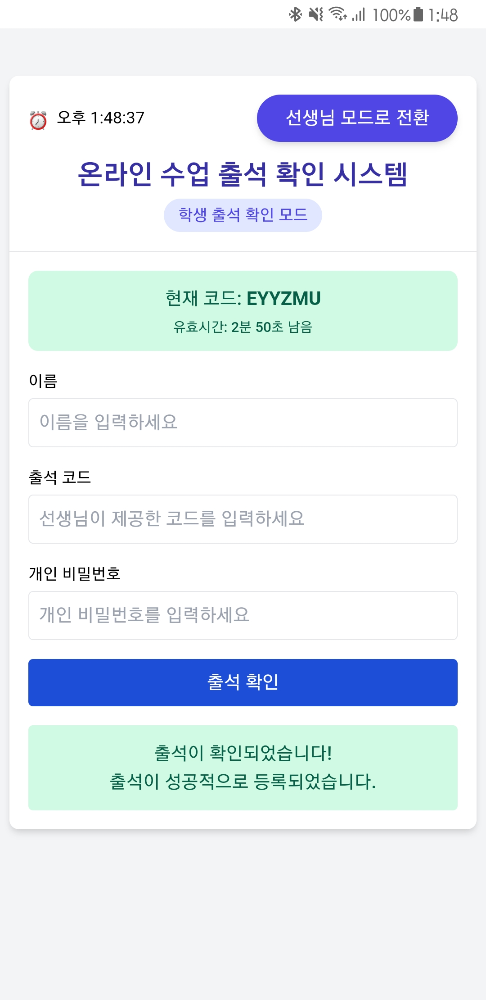

# 🎓 온라인 출석 관리 시스템

[](https://portal.azure.com)
[](https://python.org)
[](https://flask.palletsprojects.com)
[]()

MS AI School 온라인 수업을 위한 실시간 출석 확인 시스템입니다. 선생님이 생성한 시간 제한 출석 코드를 통해 학생들의 출석을 관리하고, 실시간으로 출석 현황을 모니터링할 수 있습니다.

## ✨ 주요 기능

### 👨‍🏫 선생님 모드
- **출석 코드 생성**: 5분간 유효한 보안 출석 코드 생성
- **실시간 모니터링**: 학생들의 출석 현황 실시간 확인
- **학생 관리**: 학생 추가/삭제/복구 기능
- **데이터 내보내기**: 출석부 및 비밀번호 목록 CSV 다운로드
- **출석부 초기화**: 새로운 수업을 위한 출석 상태 리셋

### 👨‍🎓 학생 모드
- **간편 출석**: 이름, 출석코드, 개인비밀번호로 출석 체크
- **실시간 피드백**: 출석 성공/실패 즉시 확인
- **모바일 친화적**: 스마트폰에서도 편리한 사용

### 🔧 시스템 기능
- **실시간 업데이트**: 자동 새로고침으로 최신 상태 유지
- **반응형 디자인**: 모바일/태블릿/데스크톱 모두 지원
- **안전한 데이터 저장**: JSON 파일 기반 로컬 데이터 관리
- **접근성**: 직관적인 UI/UX 디자인

## 🖼️ 스크린샷

### 선생님 관리 화면


### 학생 출석 화면


### 모바일 지원


## 🚀 빠른 시작

### 로컬 개발 환경
```bash
# 저장소 클론
git clone https://github.com/your-username/attendance-system.git
cd attendance-system

# 가상환경 생성 및 활성화
python -m venv venv
source venv/bin/activate  # Windows: venv\Scripts\activate

# 의존성 설치
pip install -r requirements.txt

# 환경변수 설정
cp .env.example .env
# .env 파일을 편집하여 TEACHER_PASSWORD 설정

# 애플리케이션 실행
python app.py
```

애플리케이션이 http://localhost:8000 에서 실행됩니다.

### Azure WebApp 배포
자세한 배포 가이드는 [DEPLOYMENT_MANUAL.md](DEPLOYMENT_MANUAL.md)를 참고하세요.

## 📋 사용 방법

### 1️⃣ 출석부 초기화
선생님 모드에서 **출석부 초기화** 버튼으로 새로운 수업 준비

### 2️⃣ 출석 코드 생성
**코드 생성** 버튼으로 5분간 유효한 출석 코드 생성

### 3️⃣ 학생 출석 확인
학생들이 **학생 모드**에서 다음 정보 입력:
- 이름
- 출석 코드
- 개인 비밀번호

### 4️⃣ 출석 현황 확인
실시간으로 업데이트되는 출석 현황 모니터링

### 5️⃣ 데이터 다운로드
수업 종료 후 **출석부 다운로드**로 CSV 파일 저장

## 🏗️ 시스템 아키텍처

### 백엔드 (Flask)
```
app.py              # 메인 애플리케이션
├── config.py       # 설정 관리
├── models.py       # 데이터 모델
├── services.py     # 비즈니스 로직
├── routes.py       # API 라우트
└── utils/          # 유틸리티
    ├── security.py     # 보안 기능
    ├── logging_config.py # 로깅 설정
    └── error_handlers.py # 에러 처리
```

### 프론트엔드 (React)
```
static/js/
├── components/     # React 컴포넌트
│   ├── AttendanceCodeCard.js
│   ├── StudentTable.js
│   ├── Modals.js
│   └── ...
└── main_refactored.js # 메인 애플리케이션
```

### 데이터 저장
```
students.json       # 학생 정보
attendance.json     # 출석 기록
logs/
└── deleted_students.json # 삭제된 학생 로그
```

## 🔒 보안 기능

- **입력값 검증**: 모든 사용자 입력에 대한 철저한 검증
- **환경변수**: 중요한 설정값 환경변수로 관리
- **요청 제한**: Rate limiting으로 과도한 요청 방지
- **에러 핸들링**: 안전한 에러 메시지 처리
- **로깅**: 보안 이벤트 및 접근 기록

## 🛠️ 기술 스택

### Backend
- **Framework**: Flask 2.3.3
- **Language**: Python 3.8+
- **Data Storage**: JSON Files
- **Security**: Custom validation & Rate limiting

### Frontend
- **Framework**: React 17 (CDN)
- **Styling**: Tailwind CSS 2.2.19
- **UI Components**: Custom React components

### Deployment
- **Platform**: Azure WebApp (Free Tier)
- **CI/CD**: GitHub Actions
- **Server**: Gunicorn (Production)

## 📊 API 엔드포인트

### 학생 관리
- `GET /api/students` - 학생 목록 조회
- `DELETE /api/students/<id>` - 학생 삭제
- `POST /api/students/restore` - 학생 복구

### 출석 관리
- `GET /api/code` - 현재 출석코드 조회
- `POST /api/code/generate` - 새 출석코드 생성
- `POST /api/attendance` - 출석 확인
- `POST /api/attendance/reset` - 출석부 초기화

### 데이터 내보내기
- `GET /api/attendance/download` - 출석부 CSV 다운로드
- `GET /api/students/passwords` - 비밀번호 목록 다운로드

## 🧪 테스트

### 수동 테스트 시나리오
1. **선생님 기능 테스트**
   - 출석코드 생성 → 5분 후 만료 확인
   - 학생 삭제 → 복구 테스트
   - 출석부 초기화 → 데이터 다운로드

2. **학생 기능 테스트**
   - 정확한 정보로 출석 → 성공 확인
   - 잘못된 정보로 출석 → 실패 메시지 확인
   - 만료된 코드로 출석 → 만료 메시지 확인

### CI/CD 테스트
GitHub Actions를 통한 자동 테스트:
- Python 구문 검사 (flake8)
- 모듈 import 테스트
- Flask 앱 시작 테스트

## 📝 개발 가이드

### 새로운 기능 추가
1. `services.py`에 비즈니스 로직 추가
2. `routes.py`에 API 엔드포인트 추가
3. React 컴포넌트 생성 또는 수정
4. 필요시 `models.py`에 데이터 모델 추가

### 코드 스타일
- Python: PEP 8 준수
- JavaScript: ESLint 권장사항 준수
- 커밋 메시지: Conventional Commits 형식

## 🐛 알려진 이슈

- **Azure Free Tier 제한**: 1GB 메모리, 60분/일 CPU 제한
- **파일 저장소**: Azure 재시작 시 임시 파일 손실 가능성
- **동시 접속**: 대규모 동시 접속 시 성능 저하 가능

## 🤝 기여하기

1. Fork the Project
2. Create your Feature Branch (`git checkout -b feature/AmazingFeature`)
3. Commit your Changes (`git commit -m 'Add some AmazingFeature'`)
4. Push to the Branch (`git push origin feature/AmazingFeature`)
5. Open a Pull Request

## 📄 라이선스

이 프로젝트는 교육 목적으로 개발되었습니다. 상업적 사용 시 별도 문의 바랍니다.

## 📞 지원

- **Issues**: GitHub Issues 페이지
- **Documentation**: [DEPLOYMENT_MANUAL.md](DEPLOYMENT_MANUAL.md)
- **Email**: your-email@example.com (선택사항)

## 🙏 감사의 말

- MS AI School 교육 과정에서 영감을 받아 개발
- Flask 및 React 커뮤니티의 훌륭한 문서들
- Azure의 무료 호스팅 서비스

---

⭐ 이 프로젝트가 도움이 되었다면 별표를 눌러주세요!