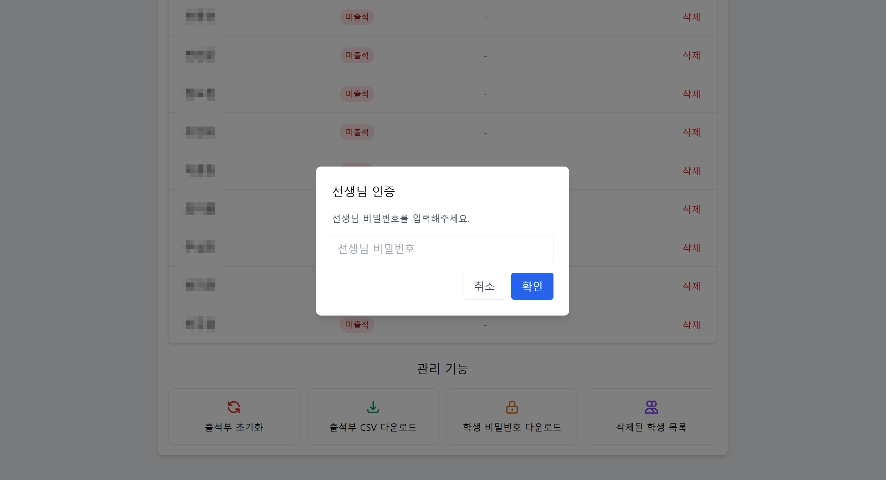

# 출석 관리 시스템 사용 가이드

이 문서는 출석 관리 시스템 프로젝트의 사용법에 대한 안내입니다. 이 시스템은 엑셀 파일에서 학생들의 이름 정보를 불러와 출석 체크를 관리하는 웹 기반 애플리케이션입니다.

## 목차

1. [시스템 개요](#시스템-개요)
2. [초기 설정](#초기-설정)
3. [선생님 모드 사용법](#선생님-모드-사용법)
4. [학생 모드 사용법](#학생-모드-사용법)
5. [학생 관리 기능](#학생-관리-기능)
6. [관리자 기능](#관리자-기능)

## 시스템 개요

이 출석 관리 시스템은 다음과 같은 기능을 제공합니다:

- 엑셀 파일에서 학생 명단 자동 추출
- 자동 생성되는 출석 코드를 통한 출석 확인
- 학생별 비밀번호 관리
- 출석 현황 실시간 모니터링
- 출석 데이터 CSV 내보내기
- 학생/선생님 모드 전환
- **학생 삭제 및 복구 기능**
- **엑셀 파일과 학생 명단 자동 동기화**
- **커스텀 favicon 지원**

## 초기 설정

### 1. 프로젝트 설치

```bash
# 필요한 패키지 설치
pip install -r requirements.txt
```

### 2. 학생 명단 준비하기

1. 엑셀 파일 준비
   - 엑셀 파일의 시트에 학생 이름이 포함된 열이 있어야 합니다.
   - 기본 파일명: `MS AI School 6기 Teams 계정.xlsx`
   - 열 이름으로 '이름', 'Name', '성명', '학생명' 등이 인식됩니다.

2. 엑셀 파일에서 학생 목록 추출
   ```bash
   python excel-to-students.py
   ```
   - 이 명령어를 실행하면 `students.json` 파일이 생성됩니다.
   - 동명이인의 경우 자동으로 A, B, C 등의 접미사가 추가됩니다.

3. 학생 비밀번호 생성
   ```bash
   python add-passwords-to-students.py
   ```
   - 모든 학생에게 4자리 숫자로 구성된 비밀번호가 자동 생성됩니다.

### 3. 서버 시작하기

```bash
python app.py
```

- 서버는 기본적으로 `http://localhost:5000/`에서 실행됩니다.
- 개발 환경에서는 Flask 내장 서버가 사용되며, 프로덕션 환경에서는 Waitress 서버가 사용됩니다.

## 선생님 모드 사용법

### 1. 모드 전환
애플리케이션 접속 시 기본적으로 선생님 모드로 시작합니다. 학생 모드에서 선생님 모드로 전환하려면 화면 하단의 "선생님 모드로 전환" 버튼을 클릭합니다.

### 2. 출석 코드 확인
선생님 모드의 메인 화면에서는 현재 유효한 출석 코드가 크게 표시됩니다:
- 출석 코드는 5분마다 자동으로 갱신됩니다.
- 이 코드를 학생들에게 공유하여 출석을 확인합니다.

### 3. 출석 현황 확인
화면 중앙에 학생 출석 현황 테이블이 표시됩니다:
- 이름
- 출석 상태 (출석/미출석)
- 확인 시간
- **관리 (삭제 버튼)**

### 4. 관리 기능


선생님 모드에서는 다음과 같은 관리 기능을 사용할 수 있습니다:

- **출석부 초기화**: 모든 학생의 출석 상태를 미출석으로 리셋합니다.
- **출석부 CSV 다운로드**: 현재까지의 출석 기록을 CSV 파일로 다운로드합니다.
- **학생 비밀번호 다운로드**: 학생들의 이름과 비밀번호 목록을 CSV 파일로 다운로드합니다.
- **삭제된 학생 목록**: 이전에 삭제된 학생 목록을 조회하고 필요시 복구할 수 있습니다.

> 참고: 관리 기능을 사용하려면 선생님 비밀번호(기본값: 'teacher')를 입력해야 합니다.

## 학생 모드 사용법


### 1. 모드 전환
화면 하단의 "학생 모드로 전환" 버튼을 클릭하여 학생 모드로 전환합니다.

### 2. 출석 체크하기
학생 모드에서는 다음 정보를 입력하여 출석을 체크합니다:

1. **이름**: 본인의 이름을 정확히 입력합니다.
2. **출석 코드**: 선생님이 제공한 현재 유효한 출석 코드를 입력합니다.
3. **개인 비밀번호**: 개인에게 부여된 비밀번호를 입력합니다.

모든 정보를 입력한 후 "출석 확인" 버튼을 클릭합니다.

- 성공적으로 출석이 확인되면 녹색 배경의 확인 메시지가 표시됩니다.
- 실패하면 빨간색 배경의 오류 메시지가 표시됩니다.

## 학생 관리 기능

### 1. 학생 삭제 기능

선생님 모드에서 학생을 삭제할 수 있습니다:

1. 학생 목록에서 삭제하려는 학생의 행 오른쪽 끝에 있는 '삭제' 버튼을 클릭합니다.
2. 삭제 확인 팝업에서 선생님 비밀번호를 입력합니다.
3. '삭제' 버튼을 클릭하여 학생을 삭제합니다.

> 삭제된 학생 정보는 로그 파일에 저장되어 나중에 복구할 수 있습니다.

### 2. 삭제된 학생 관리

선생님 모드에서 삭제된 학생을 복구할 수 있습니다:

1. '삭제된 학생 목록' 버튼을 클릭합니다.
2. 선생님 비밀번호를 입력합니다.
3. 삭제된, 학생 목록에서 복구하려는 학생 옆의 '복구' 버튼을 클릭합니다.

### 3. 엑셀 파일 동기화 (update_students.py)

엑셀 파일을 수정하고 학생 명단을 자동으로 업데이트할 수 있습니다:

```bash
python update_students.py
```

이 스크립트는 다음과 같이 작동합니다:
- 엑셀 파일에서 최신 학생 명단을 가져옵니다.
- 기존 학생의 비밀번호와 출석 상태를 유지합니다.
- 새로운 학생을 추가하고 엑셀에 없는 학생은 자동으로 삭제합니다.
- 중간에 수업을 그만둔 학생들을 효율적으로 관리할 수 있습니다.

다른 엑셀 파일을 사용하려면:

```bash
python update_students.py "다른파일이름.xlsx"
```

## 관리자 기능

### 엑셀에서 학생 명단 추출 (커스터마이징)

기본 엑셀 파일 처리가 요구사항에 맞지 않는 경우, `excel-to-students.py` 파일의 파라미터를 조정할 수 있습니다:

- 다른 엑셀 파일을 사용하려면 코드에서 `excel_file` 변수의 값을 변경합니다.
- 수동으로 학생 명단을 입력하려면 `create_students_manually` 함수를 사용합니다.

```python
# 예시: 수동으로 학생 목록 입력
student_names = [
    "김민준", "이서연", "이수민", "박지호", "정우진"
]
manual_students = create_students_manually(student_names)
save_students_to_json(manual_students)
```

### 선생님 비밀번호 변경

보안을 위해 `static/js/main.js` 파일과 `app.py` 파일에서 선생님 비밀번호를 변경할 수 있습니다:

1. `static/js/main.js` 파일에서:
```javascript
// verifyTeacherPassword 함수에서 'teacher'를 원하는 비밀번호로 변경합니다
if (teacherPassword !== 'teacher') {
  // 변경 예시
  if (teacherPassword !== '새로운비밀번호') {
```

2. `app.py` 파일에서도 관련 코드를 동일하게 업데이트해야 합니다:
```python
# 학생 삭제 API, 복구 API 등에서 비밀번호 체크 부분 업데이트
if teacher_password != 'teacher':  # 이 부분을 수정
```

### Favicon 변경

웹 브라우저 탭에 표시되는 아이콘(favicon)을 변경할 수 있습니다:

1. 원하는 이미지 파일을 `static` 폴더에 저장합니다 (예: profile.png).
2. `templates/index.html` 파일의 `<head>` 섹션에 다음 코드가 있는지 확인합니다:
```html
<link rel="icon" href="{{ url_for('static', filename='profile.png') }}" type="image/png">
<link rel="shortcut icon" href="{{ url_for('static', filename='profile.png') }}" type="image/png">
```

---

이 시스템은 웹 브라우저를 통해 간편하게 출석 관리를 할 수 있으며, 학생별 비밀번호 인증을 통해 출석 체크의 정확성과 신뢰성을 높였습니다. 또한 출석 데이터는 자동으로 저장되고 CSV 형식으로 내보낼 수 있어 쉽게 관리할 수 있습니다. 새로 추가된 학생 삭제/복구 기능과 엑셀 동기화 도구를 통해 중간에 수업을 그만두는 학생이 있어도 효율적으로 관리할 수 있습니다.